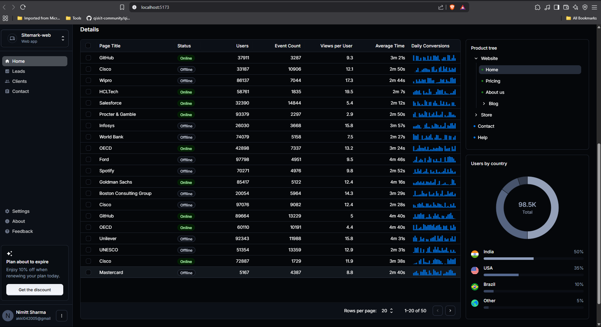

# Crystallize
## AI Driven Lead Scoring, Management cum CRM Application

This Application provides a setup to get your CRM & Lead Management working in Vite with HMR and some ESLint rules.
Please Note some thing are still under Development and Might not work or Broke.





## Features

- **Lead Scoring**: Uses machine learning (Logistic Regression) to rank leads based on conversion probability, with tailored contact strategies.
- **Client Dashboard**: Visualizes client data with summary cards, a pie chart for status, a timeline of activities, and a detailed grid.
- **Contact Hub**: Enables email, WhatsApp messaging, Skype calls, and note-taking for seamless client interactions.
- **Unified API**: Single Flask backend serving all endpoints (`/api/grid-data`, `/api/lead-scoring`, `/api/clients`) on port 5000.
## Tech Stack

- **Backend**: Flask, Pandas, Scikit-learn, SQLite
- **Frontend**: React, TypeScript, Material-UI, MUI X-Charts, MUI X-DataGrid
- **Tools**: Vite, Node.js, Python

## Prerequisites

- Python 3.8+
- Node.js 16+
- SQLite (for `crm.db`)
- Access to `Lead Scoring.csv` (sample data provided)
## Installation

1. **Clone the Repository**:

   ```bash
   git clone https://github.com/Nimittxo/Crystallize.git
   cd Crystallize
   ```

2. **Backend Setup**:

   ```bash
   cd backend
   python -m venv venv 
   source venv/bin/activate  # On Windows: venv\Scripts\activate
   (If you want Virtual env, can go with simple installation as well)

   OR simply do:

   pip install -r requirements.txt
   ```

3. **Frontend Setup**:

   ```bash
   cd ../frontend
   npm install
   ```

4. **Data Setup**:

   - Place `Lead Scoring.csv` in `backend/` (or update path in `app.py`).
   - Ensure `crm.db` is in `backend/` (schema: `grid_data` table).
   - PLEASE NOTE: ```crm.db``` is has mock data if you want your data to be there replace it with your ```crm.db```
   - The ```app.py``` will handle if you don't have ```crm.db``` willl create It's own.

## Running the App

1. **Start Backend**:

   ```bash
   cd backend
   source venv/bin/activate  # On Windows: venv\Scripts\activate
   
   Or Simply:
   python app.py
   ```

   - Runs on `http://localhost:5000`.

2. **Start Frontend**:

   ```bash
   cd frontend
   npm run dev
   ```

   - Runs on `http://localhost:5174` (or as shown in terminal).

3. **Access**:

   - Open `http://localhost:5174` in your browser.
   - Navigate to `/leads`, `/clients`, or `/contact`.

## API Endpoints

- `GET /api/grid-data`: Fetches randomized grid data from SQLite.
- `GET /api/lead-scoring`: Returns ML-scored leads with conversion probabilities.
- `GET /api/clients`: Delivers client summaries, status counts, and activities.
- Note Please handle the HTTP request from your end Because Sometimes 2 or more APIs can run or clash over a single request
- Example: ```api/clients``` run over ```5001``` so ```api/lead-scoring``` also running on ```5001``` port

## Notes

- Built in 12 hours, prioritizing functionality over polish.
- Lead data uses provided `Lead Scoring.csv`; automation limited by hackathon constraints.
- Contact page includes Skype calls (ID: `live:.cid.1f985563efdb9dcf`) and note persistence via `localStorage`.
- Headover to ```components/ContactPage.tsx``` and change or modify things accordingly for the page to work.

## License

MIT License

## For Linting

You can also install [eslint-plugin-react-x](https://github.com/Rel1cx/eslint-react/tree/main/packages/plugins/eslint-plugin-react-x) and [eslint-plugin-react-dom](https://github.com/Rel1cx/eslint-react/tree/main/packages/plugins/eslint-plugin-react-dom) for React-specific lint rules:

```js
// eslint.config.js
import reactX from 'eslint-plugin-react-x'
import reactDom from 'eslint-plugin-react-dom'

export default tseslint.config({
  plugins: {
    // Add the react-x and react-dom plugins
    'react-x': reactX,
    'react-dom': reactDom,
  },
  rules: {
    // other rules...
    // Enable its recommended typescript rules
    ...reactX.configs['recommended-typescript'].rules,
    ...reactDom.configs.recommended.rules,
  },
})
```
